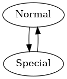

# Example Explanation

The example "flight" software implments an extremely simple state machine containing the two states "Normal" and "Special". Both states have their own tasks that run, with a few tasks shared among the two. 

To build execute: `sh build.sh plugs/example` in the state_machine folder

To run execute: `sh run.sh`

## StateMachineConfig.py

Contains the config which defines the following.
1. Which states exist
2. Which tasks run for each state, along with the following properties
    1. The interval at which they are run
    2. Their priority
    3. If they are to be "ScheduledLater" or run immediately when entering the state. 
3. Which transitions are allowed
4. Which functions are run whenever entering an exiting a state (note that the current state, future state, and cubesat is passed to these functions)
5. The TaskMap which maps task names (strings) to their coresponding objects
6. The TransitionFunctionMap which maps names (strings) to their coresponding functions

## lib/pycubed.py

Bare bones emulation of a sattelite, so that we can get "voltage" readings.
In a real plugin this would be a much more complex emulation, or the real pycubed driver.

## Tasks/battery_task.py

This reads the "battery_voltage" and prints it to the console.

## Tasks/every_5_seconds.py

This task runs every 5 seconds, and prints to the console.

## Tasks/template_task.py

This is the template task that all tasks inherit from, in most cases you can leave it unmodified.

## Tasks/time_task.py

This task gets and prints the current uptime

## Tasks/transition_task.py

This task switches the state between Normal and Special mode.
In the state machine config, we set it to run later so that it runs in 20 or 15 seconds depending on the state.

